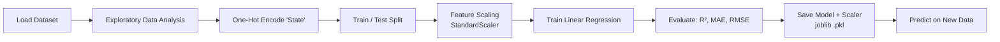
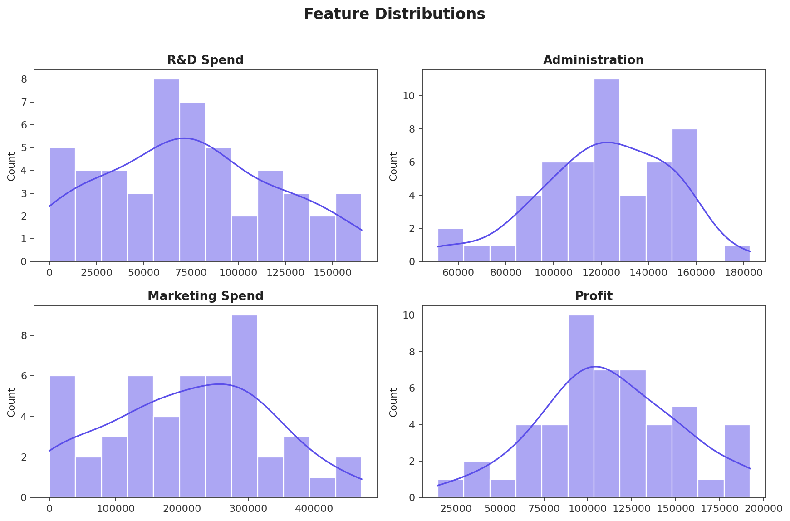
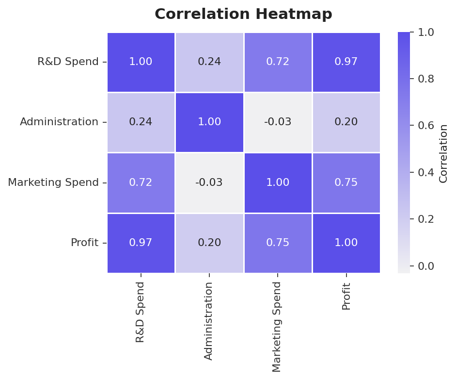
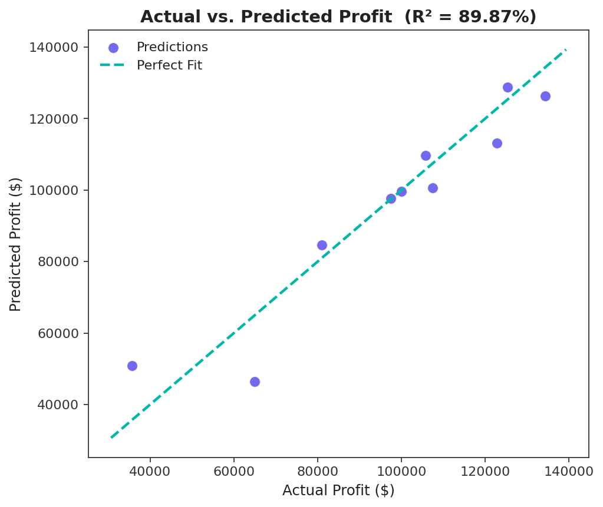
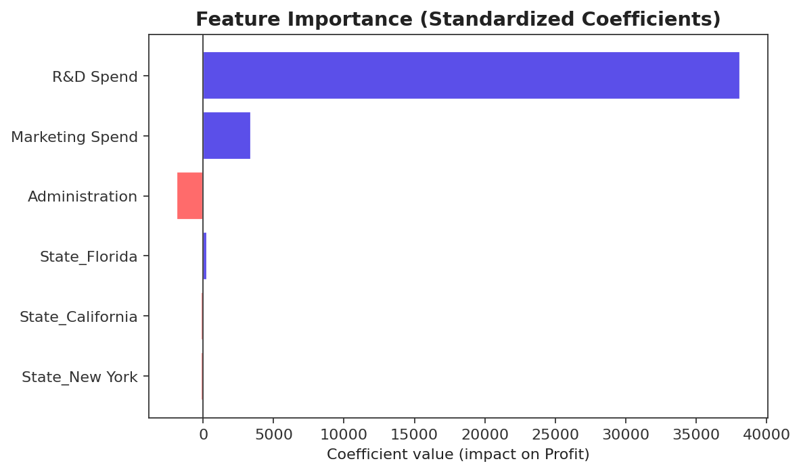

<p align="center">
  
</p>

<h3 align="center">Predicting startup profitability from R&D, Administration, and Marketing spend using Multiple Linear Regression</h3>

<p align="center">
  
  
  
  
  
</p>

---

## 📌 Overview

This project builds a **Multiple Linear Regression** model that predicts a startup's **profit** from four inputs: how much it spends on **R&D**, **Administration**, and **Marketing**, and which **state** it operates in. It walks through a complete, realistic ML workflow — exploratory data analysis, categorical encoding, feature scaling, model training, evaluation, and model persistence for reuse — on the well-known `50_Startups` dataset.

The goal wasn't just to fit a model, but to practice the full lifecycle a data scientist actually follows: understand the data first, engineer it correctly, validate the model honestly, and leave behind an artifact (a saved `.pkl` model) that could be plugged into an application.

**Key result:** the final model explains roughly **90–92% of the variance** in startup profit (R² score) using only four business inputs.

## 📖 Table of Contents

- [Dataset](#-dataset)
- [Project Workflow](#-project-workflow)
- [Exploratory Data Analysis](#-exploratory-data-analysis)
- [Modeling](#-modeling)
- [Results](#-results)
- [Tech Stack](#-tech-stack)
- [Project Structure](#-project-structure)
- [Getting Started](#-getting-started)
- [Key Learnings & Future Work](#-key-learnings--future-work)
- [Author](#-author)

## 📊 Dataset

The dataset contains **50 records** of U.S. startups and their spending across three categories, along with the state they're based in and the profit they generated.

| Column | Description | Type |
|---|---|---|
| `R&D Spend` | Amount spent on Research & Development | Numeric ($) |
| `Administration` | Amount spent on administrative overhead | Numeric ($) |
| `Marketing Spend` | Amount spent on marketing | Numeric ($) |
| `State` | Headquarters location — New York, California, or Florida | Categorical |
| `Profit` | Net profit generated (**target variable**) | Numeric ($) |

No missing values were present in any column. `State` was one-hot encoded into three binary indicator columns (`State_California`, `State_Florida`, `State_New York`) so the model could use location as a numeric input.

## 🔁 Project Workflow



## 🔍 Exploratory Data Analysis

Before modeling, the data was profiled to understand its shape, spread, and relationships.

<p align="center">
  
</p>

**What the correlation heatmap revealed:**

<p align="center">
  
</p>

- **R&D Spend is the strongest driver of Profit** — a correlation of **0.97**, nearly a straight line.
- **Marketing Spend** is also meaningfully correlated with Profit (**0.75**).
- **Administration spend** has almost no linear relationship with Profit (**0.20**), hinting it may contribute little predictive power.
- R&D and Marketing spend are themselves correlated (**0.72**), a mild multicollinearity signal worth keeping in mind when interpreting coefficients.

## 🧠 Modeling

The model was built as a standard supervised regression pipeline:

1. **Encoding** — `State` converted to one-hot indicator columns with `pandas.get_dummies`.
2. **Splitting** — data split **80% train / 20% test** with `train_test_split`.
3. **Scaling** — all features standardized with `StandardScaler` (fit on train, applied to test) so that no single feature dominates purely due to its numeric scale.
4. **Training** — a `LinearRegression` model fit on the scaled training data.
5. **Evaluation** — performance measured with **R², MAE, and RMSE** on the held-out test set.
6. **Persistence** — both the trained model and the fitted scaler were serialized with `joblib` (`model.pkl`, `scaler.pkl`) so predictions can be made on new data without retraining.

## 📈 Results

| Metric | Score |
|---|---|
| **R² Score** | **~90–92%** |
| Mean Absolute Error (MAE) | ≈ $6,900 |
| Root Mean Squared Error (RMSE) | ≈ $9,000 |

> The notebook's own run scored **91.95% R²** (8.05% error). Because the train/test split isn't seeded, the exact score shifts slightly (typically 88–92%) between runs — the chart below is from one such run (R² = 89.87%). Fixing a `random_state` is one of the first improvements noted below.

<p align="center">
  
</p>

Predicted profits track actual profits closely across the range, with the model doing best on mid-to-high profit startups and slightly under/over-shooting at the extremes — expected behavior for a small, 50-row dataset.

**Feature importance**, read directly from the model's standardized coefficients, confirms what the EDA suggested:

<p align="center">
  
</p>

- 💰 **R&D Spend dominates** — by far the largest positive contributor to predicted profit.
- 📣 **Marketing Spend** helps, but with far less impact than R&D.
- 🧾 **Administration spend has a small *negative* coefficient** — more overhead is (weakly) associated with lower profit, not higher.
- 📍 **State has almost no effect** — location barely moves the prediction once spend is accounted for.

## 🛠 Tech Stack

| Category | Tools |
|---|---|
| Language | Python 3 |
| Data Handling | pandas |
| Visualization | matplotlib, seaborn |
| Machine Learning | scikit-learn (`LinearRegression`, `StandardScaler`, `train_test_split`) |
| Model Persistence | joblib |
| Environment | Jupyter Notebook |

## 📁 Project Structure

```
Startup-Profit-Prediction/
├── assets/                     # README images
│   ├── banner.png
│   ├── eda_distributions.png
│   ├── correlation_heatmap.png
│   ├── actual_vs_predicted.png
│   └── feature_importance.png
├── data/
│   └── 50_Startups.csv         # source dataset
├── Startup_model_Pred.ipynb    # full analysis + model notebook
├── model.pkl                   # trained LinearRegression model (generated)
├── scaler.pkl                  # fitted StandardScaler (generated)
├── requirements.txt
└── README.md
```

## 🚀 Getting Started

**1. Clone the repository**
```bash
git clone https://github.com/<your-username>/Startup-Profit-Prediction.git
cd Startup-Profit-Prediction
```

**2. Install dependencies**
```bash
pip install -r requirements.txt
```

**3. Run the notebook**
```bash
jupyter notebook Startup_model_Pred.ipynb
```

**4. Or use the saved model directly for inference**
```python
import joblib

model = joblib.load('model.pkl')
scaler = joblib.load('scaler.pkl')

# [R&D Spend, Administration, Marketing Spend, State_California, State_Florida, State_New York]
new_data = [[165349.20, 136897.80, 471784.10, 0, 1, 0]]
new_data_scaled = scaler.transform(new_data)

prediction = model.predict(new_data_scaled)
print(f"Predicted Profit: ${prediction[0]:,.2f}")
```

## 💡 Key Learnings & Future Work

Building this end-to-end helped reinforce a few practical lessons — and pointed to clear next steps:

- [ ] **Fix the random seed** (`random_state=42`) in `train_test_split` for reproducible, comparable results across runs.
- [ ] **Test feature selection** — since Administration contributes little signal, compare performance with and without it (or try backward elimination / p-value-based selection).
- [ ] **Try regularized models** (Ridge, Lasso) to handle the mild multicollinearity between R&D and Marketing spend.
- [ ] **Cross-validation** instead of a single train/test split, given the small dataset size (50 rows).
- [ ] **Compare against non-linear models** (Random Forest, Gradient Boosting) to check whether the relationship is truly linear or if there's non-linear signal being missed.
- [ ] **Wrap the saved model in a small API or Streamlit app** so it's usable outside a notebook.

## 👤 Author

**Pranit Hatwar**
📧 pranithatwar@gmail.com · 🔗 [LinkedIn](linkedin.com/in/pranit-hatwar) · 🐙 [GitHub](https://github.com/Inevitableee/)

---

<p align="center"><i>If you found this project useful or interesting, consider ⭐ starring the repo!</i></p>
